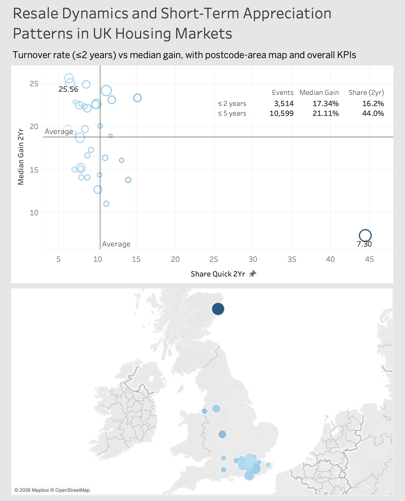

# UK Property Resales & Price Growth Dashboard (Tableau + R)

## Overview

This project analyzes UK property sales data to identify where quick resales are most common and how property values change from first to last recorded sale. Data was cleaned and transformed in R to define resale windows (≤2 and ≤5 years) and compute long-term price change metrics.

The final deliverable is an interactive Tableau dashboard designed for everyday viewers, supported by a plain-language Notion write-up and documented methodology to ensure clarity and reproducibility.

---

## Links

- **Tableau Public Dashboard:**  
  <https://public.tableau.com/views/Tableau_Visuals_Q3/ResaleDynamicsandShort-TermAppreciationPatternsinUKHousingMarkets?:language=en-US&:sid=&:redirect=auth&:display_count=n&:origin=viz_share_link>

- **Plain-Language Write-Up (Notion):**  
  <https://historical-crater-ccc.notion.site/Quick-Resales-in-UK-Property-Sales-30a14b513c6d8026876fd5085d2f616e?source=copy_link>

---

## Dashboard Preview

  

---

## What’s Included

- **Interactive Tableau Dashboard**  
  Published on Tableau Public with filters and geographic views for exploring resale patterns.

- **Plain-Language Write-Up (Notion)**  
  Clear, non-technical explanation of the analysis, findings, and implications written for everyday home buyers and sellers.

- **R Data Preparation Scripts**  
  Scripts used to clean the dataset, engineer resale windows (≤2 and ≤5 years), and compute first-to-last sale price changes.

- **Methodology & Documentation**  
  Definitions, assumptions, and key metric explanations to ensure transparency and reproducibility.

- **Dashboard Screenshots**  
  Static previews of the final dashboard for quick viewing within GitHub.

---

## Key Metrics

- Quick Resale Rate (≤2 years)
- Quick Resale Rate (≤5 years)
- First-to-Last Sale % Change
- Postcode area comparisons (maps and scatter plots)

---

## Tools

R (tidyverse, lubridate), Tableau Public
